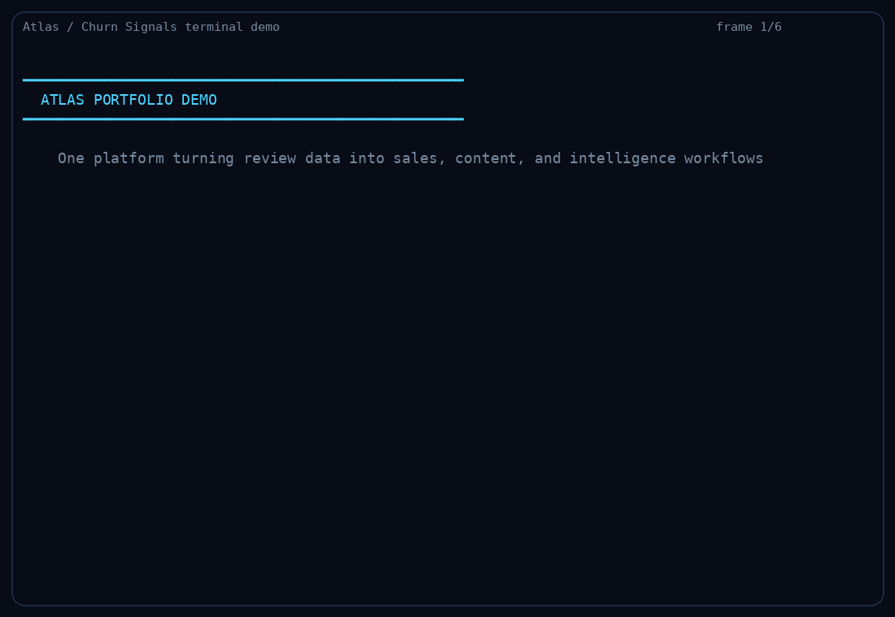
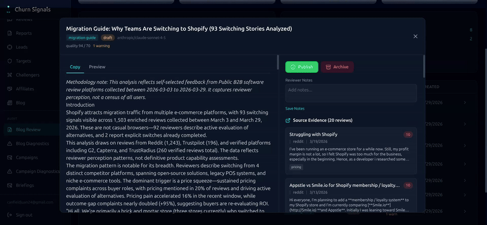

# ATLAS

ATLAS is a solo-built applied AI platform focused on evidence-grounded workflows, autonomous operations, and business-facing software. The system combines data ingestion, LLM enrichment, retrieval, reasoning synthesis, operator review, and scheduled execution to turn raw external signals into usable product surfaces and downstream artifacts.

The current product focus is B2B churn intelligence and GTM automation, but the underlying work is broader than a single sales workflow. ATLAS is also a portfolio of production patterns for deterministic reasoning layers, retrieval-backed memory, evaluation loops, review tooling, and end-to-end AI system operations.

If you want a quick tour, start here:

- **Live product**: [churnsignal.co](https://churnsignal.co)
- **Curated terminal demo**: [`recordings/portfolio-demo.cast`](recordings/portfolio-demo.cast)
- **Raw review to evidence-backed campaign**: [`pipeline-walkthrough/WALKTHROUGH.md`](pipeline-walkthrough/WALKTHROUGH.md)
- **Full source code**: [github.com/canfieldjuan/ATLAS](https://github.com/canfieldjuan/ATLAS)

[](recordings/portfolio-demo.cast)

---

## Flagship Demos

### 1. Churn Signal -> Evidence-Backed Campaign

**What it shows**
- A raw G2 review becomes structured intelligence, then turns into a personalized outbound campaign and a competitive battle card.
- The same evidence pipeline feeds multiple downstream artifacts instead of producing isolated one-off outputs.

**Why it matters**
- Shows how ATLAS turns noisy source material into reusable evidence, reasoning, and delivery layers.
- Demonstrates a production workflow instead of a one-shot demo.

**Open**
- Demo page: [`demos/churn-to-campaign.md`](demos/churn-to-campaign.md)
- Walkthrough: [`pipeline-walkthrough/WALKTHROUGH.md`](pipeline-walkthrough/WALKTHROUGH.md)
- Sample raw review: [`pipeline-walkthrough/01_raw_review.json`](pipeline-walkthrough/01_raw_review.json)
- Sample enriched review: [`pipeline-walkthrough/02_enriched_review.json`](pipeline-walkthrough/02_enriched_review.json)
- Sample churn signal: [`pipeline-walkthrough/03_churn_signal.json`](pipeline-walkthrough/03_churn_signal.json)
- Sample evidence vault: [`pipeline-walkthrough/04_evidence_vault.json`](pipeline-walkthrough/04_evidence_vault.json)
- Sample campaign output: [`pipeline-walkthrough/05_campaign_output.json`](pipeline-walkthrough/05_campaign_output.json)
- Sample battle card: [`pipeline-walkthrough/06_battle_card.json`](pipeline-walkthrough/06_battle_card.json)

### 2. Curated Terminal Demo

**What it shows**
- A short terminal walkthrough of the core Atlas story.
- Live scrape activity, structured enrichment, a generated campaign artifact, and a generated blog artifact in one short demo.

**Why it matters**
- It explains the business value quickly instead of requiring someone to infer it from raw logs.
- It still uses live data, but the flow is curated to show the strongest platform behaviors clearly.

**Open**
- Curated cast: [`recordings/portfolio-demo.cast`](recordings/portfolio-demo.cast)
- GIF preview: [`recordings/gifs/portfolio-terminal.gif`](recordings/gifs/portfolio-terminal.gif)
- Local replay: `asciinema play recordings/portfolio-demo.cast`
- Curated script: [`recordings/portfolio-demo.sh`](recordings/portfolio-demo.sh)
- Live ops version: [`recordings/pipeline-demo.cast`](recordings/pipeline-demo.cast)
- Live ops script: [`recordings/demo.sh`](recordings/demo.sh)

### 3. AI Review, QA, and Publishing Workflow

**What it shows**
- Atlas does not stop at generation. It validates outputs, tracks retries, surfaces quality issues, and provides review flows before publish or downstream use.
- The same platform powers blog review, prepublish preview, artifact validation, and reasoning provenance.

**Why it matters**
- This is the difference between AI demos and production AI software.
- It shows operator tooling, auditability, and workflow safety around model-generated outputs.

**Open**
- Demo page: [`demos/ai-review-console.md`](demos/ai-review-console.md)
- Blog review page: [`demos/blog-review-preview.md`](demos/blog-review-preview.md)
- Source code: [github.com/canfieldjuan/ATLAS](https://github.com/canfieldjuan/ATLAS)
- Architecture overview: [`architecture/system-overview.md`](architecture/system-overview.md)

### Quick Visual Demos

**Blog Review / Prepublish Preview**

[](recordings/ui/blog-review-preview-demo.webm)

**Pipeline Review / Quality Signals**

[](recordings/ui/pipeline-review-demo.webm)

---

## The Numbers

| Metric | Value |
|--------|-------|
| Reviews enriched | 38,881 |
| Intelligence reports generated | 2,113 |
| Cross-vendor competitive analyses | 1,732 |
| Reasoning synthesis contracts | 481 |
| Displacement edges tracked | 500+ |
| Review sources | 16 |
| Autonomous scheduled tasks | 57 |
| MCP tools | 130+ |
| LangGraph workflows | 12 |
| Database migrations | 248 |
| Skill documents | 68 |
| API endpoints | 55+ |

---

## What Atlas Does

### Sales Enablement

- Scrapes reviews from 16 sources including G2, Capterra, TrustRadius, Reddit, Gartner, HackerNews, and Twitter/X.
- Extracts 47 structured fields per review including churn intent, urgency, pain categories, buying stage, budget signals, and competitor mentions.
- Generates battle cards with discovery questions, landmine questions, objection handlers, talk tracks, and recommended plays.
- Tracks vendor-to-vendor displacement dynamics with evidence-backed competitive flows.
- Resolves account-level signals including buyer role, company identity, contract timing, and opportunity context.

### Marketing Automation

- Generates SEO content from real churn intelligence data, including vendor alternatives, migration guides, pricing reality checks, and vendor showdowns.
- Produces personalized campaigns with subject lines, body copy, CTA, and audit trail grounded in real review evidence.
- Uses prospect enrichment and account matching to connect market pain patterns to named targets and relevant content.

### Internal Operations

- Runs 57 autonomous scheduled tasks for enrichment, campaign generation, churn intelligence, blog generation, email triage, briefings, monitoring, and anomaly detection.
- Uses 12 LangGraph workflows for stateful agent behavior across email, calls, scheduling, monitoring, and automation.
- Exposes 8 MCP servers with 130+ tools across CRM, email, telephony, calendar, invoicing, intelligence, B2B churn, and memory.
- Routes work across multiple model providers depending on task type and cost profile.

### Research and Knowledge Systems

- Builds deterministic evidence pools that serve as canonical intermediate layers for every downstream artifact.
- Runs reasoning synthesis to convert those evidence pools into structured, cited reasoning contracts.
- Maintains graph-backed memory and conversation history for retrieval and continuity.

---

## Pipeline Snapshot

```text
Raw reviews (16 sources)
  -> LLM enrichment (47 structured fields per review)
  -> Churn signal aggregation
  -> Evidence pools and witness extraction
  -> Reasoning synthesis with validation and citations
  -> Output artifacts:
       - Personalized campaigns
       - SEO blog posts
       - Competitive battle cards
       - Vendor briefings
       - Intelligence reports
       - Product and account views
```

For the narrated version, open [`pipeline-walkthrough/WALKTHROUGH.md`](pipeline-walkthrough/WALKTHROUGH.md).

---

## Tech Stack

**Backend**: Python, FastAPI, asyncpg, PostgreSQL, APScheduler  
**LLM**: Ollama, vLLM, Claude API, OpenRouter, Groq, Together  
**Memory**: Neo4j, PostgreSQL  
**Agent Framework**: LangGraph, MCP  
**Scraping**: 16 review sources with proxy rotation, rate limiting, and dedup  
**CRM and GTM**: Apollo API, HubSpot, Salesforce, Pipedrive event ingestion  
**Telephony**: Twilio, SignalWire  
**Frontends**: React, Next.js  
**Infrastructure**: Docker Compose, Tailscale mesh, NVIDIA GPU  
**Tools Used to Build**: Claude Code, Cursor

---

## Additional Links

- **Live product**: [churnsignal.co](https://churnsignal.co)
- **Full source code**: [github.com/canfieldjuan/ATLAS](https://github.com/canfieldjuan/ATLAS)
- **Churn-to-campaign demo**: [`demos/churn-to-campaign.md`](demos/churn-to-campaign.md)
- **Blog review demo**: [`demos/blog-review-preview.md`](demos/blog-review-preview.md)
- **AI review and QA demo**: [`demos/ai-review-console.md`](demos/ai-review-console.md)
- **Architecture overview**: [`architecture/system-overview.md`](architecture/system-overview.md)
- **Pipeline walkthrough**: [`pipeline-walkthrough/WALKTHROUGH.md`](pipeline-walkthrough/WALKTHROUGH.md)
- **Recording assets**: [`recordings/`](recordings/)
- **Curated terminal demo**: [`recordings/portfolio-demo.cast`](recordings/portfolio-demo.cast)
- **Terminal GIF preview**: [`recordings/gifs/portfolio-terminal.gif`](recordings/gifs/portfolio-terminal.gif)
- **Blog review clip**: [`recordings/ui/blog-review-preview-demo.webm`](recordings/ui/blog-review-preview-demo.webm)
- **Pipeline review clip**: [`recordings/ui/pipeline-review-demo.webm`](recordings/ui/pipeline-review-demo.webm)
- **Campaign review clip**: [`recordings/ui/campaign-review-demo.webm`](recordings/ui/campaign-review-demo.webm)
- **Screenshot guide**: [`screenshots/CAPTURE_GUIDE.md`](screenshots/CAPTURE_GUIDE.md)
