# ATLAS

ATLAS is a solo-built applied AI platform focused on evidence-grounded workflows, autonomous operations, and business-facing software. The system combines data ingestion, LLM enrichment, retrieval, reasoning synthesis, operator review, and scheduled execution to turn raw external signals into usable product surfaces and downstream artifacts.

The current product focus is B2B churn intelligence and GTM automation, but the underlying work is broader than a single sales workflow. ATLAS is also a portfolio of production patterns for deterministic reasoning layers, retrieval-backed memory, evaluation loops, review tooling, and end-to-end AI system operations.

If you want a quick tour, start here:

- **Public product domain**: [churnsignals.co](https://churnsignals.co)
- **Curated terminal demo**: [`recordings/atlas-terminal-demo.cast`](recordings/atlas-terminal-demo.cast)
- **Raw review to evidence-backed campaign**: [`pipeline-walkthrough/WALKTHROUGH.md`](pipeline-walkthrough/WALKTHROUGH.md)
- **Full source code**: [github.com/canfieldjuan/ATLAS](https://github.com/canfieldjuan/ATLAS)

[](recordings/atlas-terminal-demo.cast)

---

## Demos

### 1. Watchlists & Vendor Intelligence

Real-time vendor monitoring with churn pattern classification, competitive sets, and accounts in motion.

[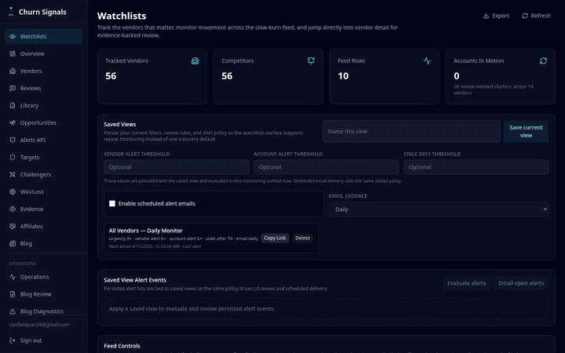](demos/watchlists-intelligence.md)

### 2. Evidence Explorer & Reasoning Transparency

Three-level evidence chain: witness excerpts, aggregated vault claims, and full reasoning trace.

[](demos/evidence-reasoning.md)

### 3. Prospects & Campaign Workflow

End-to-end GTM automation: prospect enrichment, manual review queue, campaign generation, and approval.

[](demos/prospects-campaigns.md)

### 4. Autonomous Operations

81 scheduled tasks for enrichment, content generation, reasoning synthesis, delivery, and monitoring.

[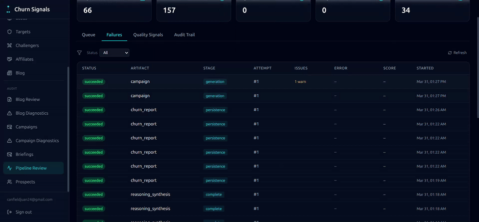](demos/autonomous-operations.md)

### 5. Pipeline Walkthrough (Technical Deep-Dive)

A single G2 review traced through every pipeline stage with real JSON artifacts.

- Walkthrough: [`pipeline-walkthrough/WALKTHROUGH.md`](pipeline-walkthrough/WALKTHROUGH.md)

### More Visual Demos

[](recordings/atlas-terminal-demo.cast)

[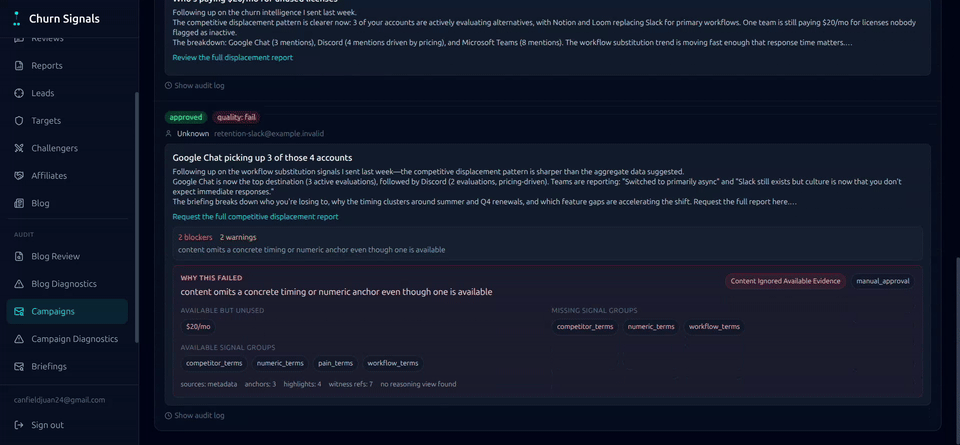](demos/autonomous-operations.md)

### Product Screenshots

| | |
|---|---|
| 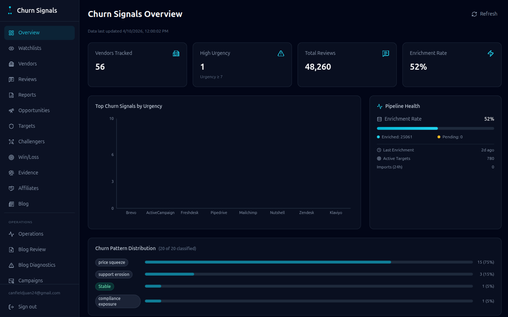 | 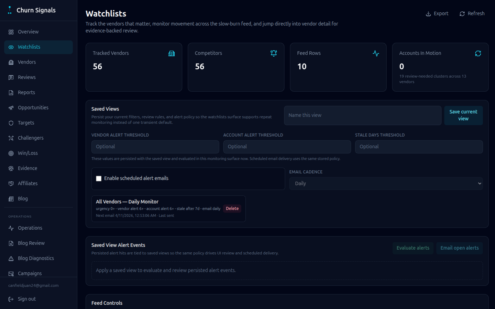 |
| Dashboard — Overview with churn signals, pipeline health, and slow-burn watchlist | Watchlists — Vendor tracking, accounts in motion, competitive sets |
| 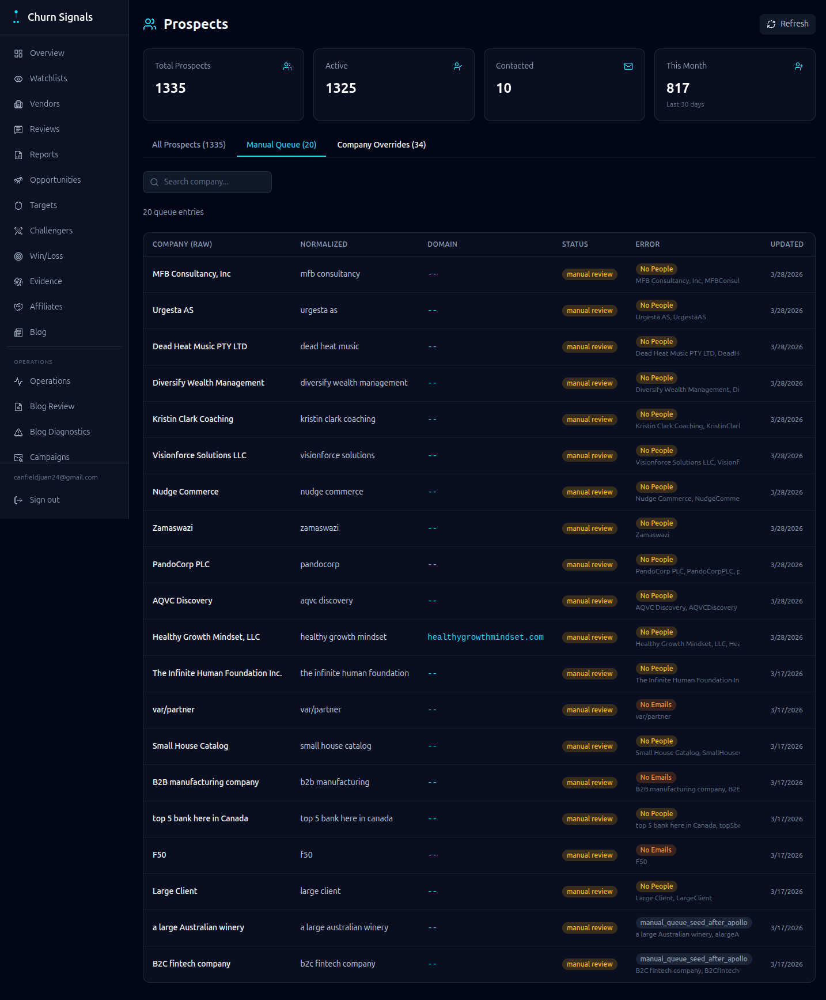 | 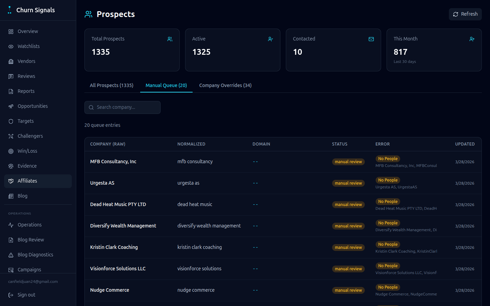 |
| Prospects — Enriched prospect table with tabs | Manual Queue — Error category badges with resolve actions |
| 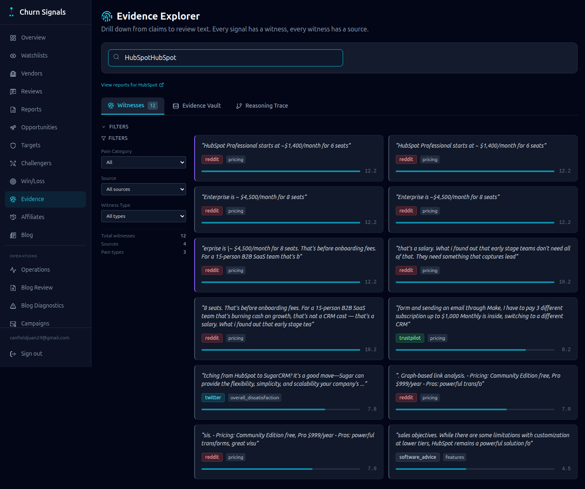 | 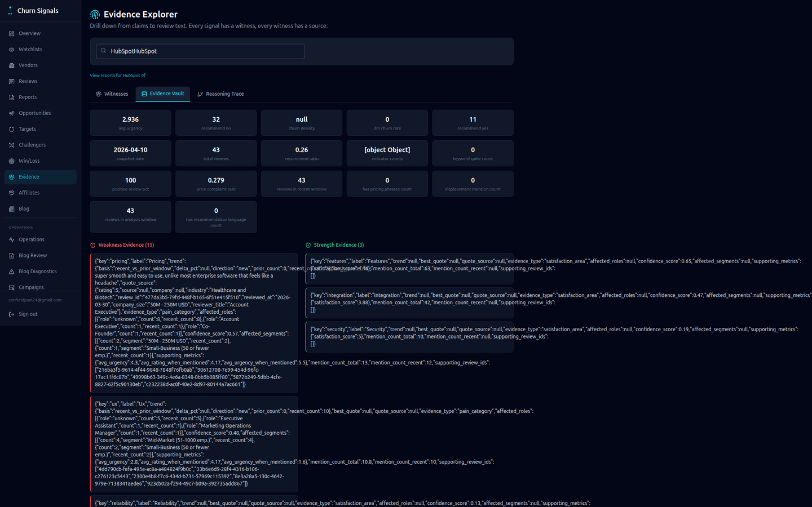 |
| Evidence Explorer — Witness excerpts with signal tags | Evidence Vault — Weakness/strength claims with metrics |
| 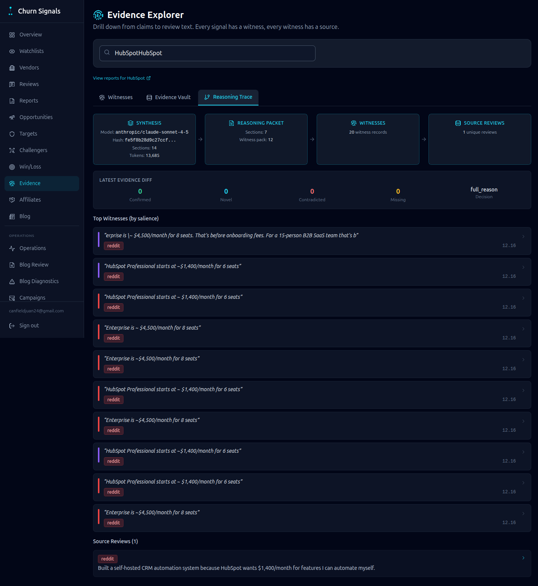 | 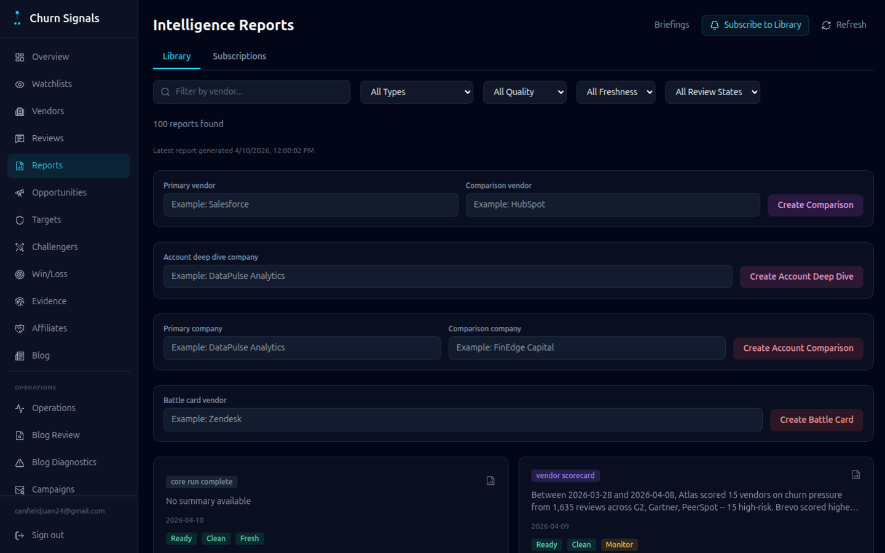 |
| Reasoning Trace — Evidence diff and synthesis provenance | Reports — Intelligence report library with trust panels |
| 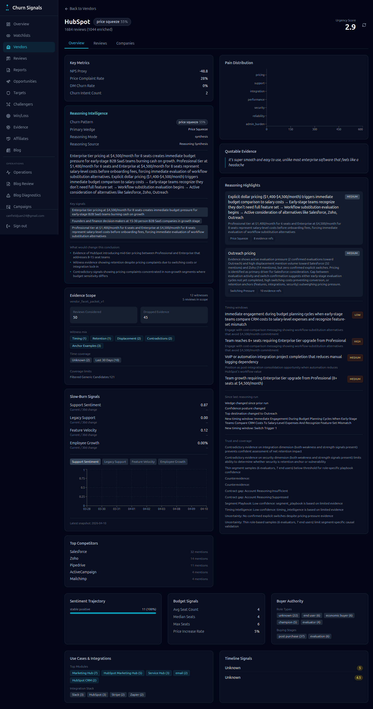 | 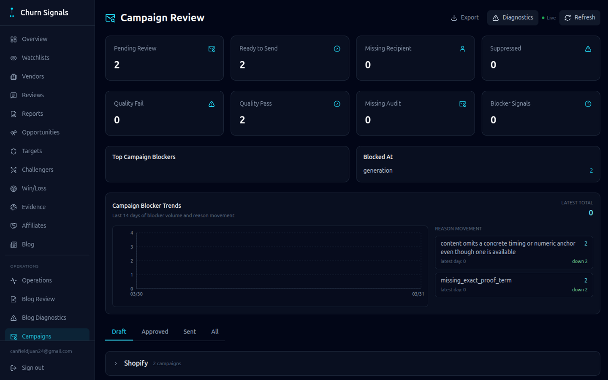 |
| Vendor Detail — HubSpot churn signal profile | Campaign Review — Draft approval queue with quality trends |
| 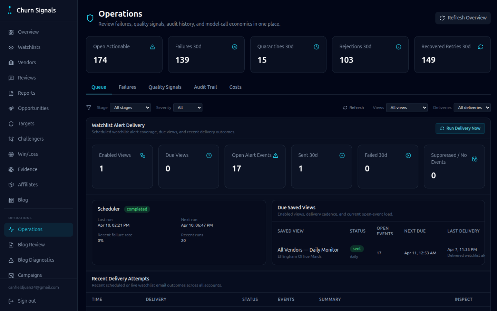 | 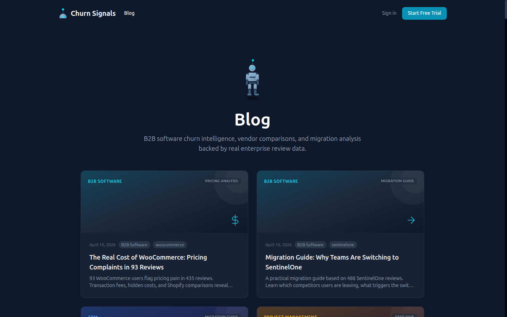 |
| Pipeline Review — Operations dashboard with quality signals | Blog — AI-generated SEO content from churn intelligence |

---

## The Numbers

Verified against the current local ATLAS repo and dataset snapshot:

| Metric | Value |
|--------|-------|
| Raw reviews stored | 48,270 |
| Reviews enriched | 25,061 |
| Vendors with churn signals | 56 |
| Intelligence reports | 1,133 |
| Cross-vendor reasoning records | 170 |
| v2 reasoning syntheses | 323 |
| Review sources | 15 |
| Autonomous scheduled tasks | 81 |
| Database migrations | 227 |
| Skill documents | 68 |
| MCP servers | 8 |
| MCP tools exposed | 130+ |
| LangGraph workflows | 12 |
| Product dashboards | 4 |
| Prospects enriched | 1,335 |
| Campaign sequences | 7 |
| Evidence vault entries | 497 |

---

## What Atlas Does

### Sales Enablement

- Scrapes reviews from 15 sources including G2, Capterra, TrustRadius, Reddit, Gartner, HackerNews, Twitter/X, GitHub, YouTube, and Stack Overflow.
- Extracts 47 structured fields per review including churn intent, urgency, pain categories, buying stage, budget signals, and competitor mentions.
- Generates battle cards with discovery questions, landmine questions, objection handlers, talk tracks, and recommended plays.
- Tracks vendor-to-vendor displacement dynamics with evidence-backed competitive flows.
- Resolves account-level signals including buyer role, company identity, contract timing, and opportunity context.

### Marketing Automation

- Generates SEO content from real churn intelligence data, including vendor alternatives, migration guides, pricing reality checks, and vendor showdowns.
- Produces personalized campaigns with subject lines, body copy, CTA, and audit trail grounded in real review evidence.
- Uses prospect enrichment and account matching to connect market pain patterns to named targets and relevant content.

### Internal Operations

- Runs 81 autonomous scheduled tasks (and growing) for enrichment, campaign generation, churn intelligence, blog generation, email triage, briefings, monitoring, and anomaly detection.
- Uses LangGraph workflows for stateful agent behavior across email, calls, scheduling, monitoring, and automation.
- Exposes MCP servers across CRM, email, telephony, calendar, invoicing, intelligence, B2B churn, and memory.
- Routes work across multiple model providers depending on task type and cost profile.

### Research and Knowledge Systems

- Builds deterministic evidence pools that serve as canonical intermediate layers for every downstream artifact.
- Runs reasoning synthesis to convert those evidence pools into structured, cited reasoning contracts.
- Maintains graph-backed memory and conversation history for retrieval and continuity.

---

## Pipeline Snapshot

```text
Raw reviews (15 sources)
  -> LLM enrichment (47 structured fields per review)
  -> Churn signal aggregation
  -> Evidence pools and witness extraction
  -> Reasoning synthesis with validation and citations
  -> Output artifacts:
       - Personalized campaigns
       - SEO blog posts
       - Competitive battle cards
       - Vendor briefings
       - Intelligence reports
       - Product and account views
```

For the narrated version, open [`pipeline-walkthrough/WALKTHROUGH.md`](pipeline-walkthrough/WALKTHROUGH.md).

---

## Other Projects

### FineTuneLab.ai | 2025–Present

A self-hosted fine-tuning platform for training and deploying language models on local hardware.

- GPU-accelerated training with Unsloth, web-based monitoring, and experiment management
- Dataset management, template-based training setup, training history, logs, and artifacts
- Deployment paths for vLLM, Ollama, Docker, and native Linux
- Stack: TypeScript, Next.js, Python, FastAPI, Supabase, Neo4j

### Coding Assistant SDK | 2024–Present

A unified AI developer platform spanning CLI, API, web IDE, code generators, and backend services.

- 17-model routing with generators for MCP, FastAPI, Express, agents, tools, and SDK workflows
- Persistent memory, context injection, project analysis, and validation workflows
- Go code-analysis backend + FastAPI LLM service
- Stack: Python, Go, TypeScript, FastAPI, Next.js

### ATLAS Edge Node | 2025–Present

A multi-modal AI edge device running on Orange Pi 5 Plus with RK3588 NPU.

- Real-time vision pipeline: YOLO World object detection (94ms NPU inference), face recognition (RetinaFace + MobileFaceNet), gait recognition (YOLOv8-pose)
- Speech pipeline: SenseVoice STT (16x realtime), Matcha-TTS synthesis, Silero VAD, speaker identification
- Person tracking with IoU-based matching and multi-modal identity fusion (face + gait + speaker)
- Bidirectional WebSocket sync with ATLAS Brain server for voice-to-voice AI interaction
- Stack: Python, RKNN, sherpa-onnx, OpenCV, asyncio

---

## Tech Stack

**Backend**: Python, FastAPI, asyncpg, PostgreSQL, APScheduler  
**LLM**: Ollama, vLLM, Claude API, OpenRouter, Groq, Together  
**Memory**: Neo4j, PostgreSQL  
**Agent Framework**: LangGraph, MCP  
**Scraping**: 15 review sources with proxy rotation, rate limiting, and dedup  
**CRM and GTM**: Apollo API, HubSpot, Salesforce, Pipedrive event ingestion  
**Telephony**: Twilio, SignalWire  
**Frontends**: React, Vite, TypeScript  
**Edge AI**: RKNN NPU inference, sherpa-onnx, OpenCV, YOLO World, RetinaFace, MobileFaceNet  
**Infrastructure**: Docker Compose, Tailscale mesh, Vercel, NVIDIA GPU, Orange Pi 5 Plus  
**Tools Used to Build**: Claude Code, Cursor

---

## Additional Links

- **Live product**: [churnsignals.co](https://churnsignals.co)
- **Full source code**: [github.com/canfieldjuan/ATLAS](https://github.com/canfieldjuan/ATLAS)
- **Demos**: [`demos/`](demos/) — Watchlists, Evidence, Prospects, Autonomous Ops
- **Pipeline walkthrough**: [`pipeline-walkthrough/WALKTHROUGH.md`](pipeline-walkthrough/WALKTHROUGH.md)
- **Architecture overview**: [`architecture/system-overview.md`](architecture/system-overview.md)
- **Recordings**: [`recordings/`](recordings/) — Terminal demo, pipeline review, campaign review, blog review
- **Screenshots**: [`screenshots/`](screenshots/) — 13 product surface screenshots
